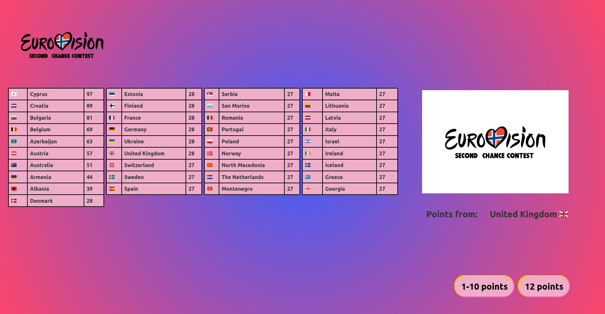

# OGAE / ESC Second Chance Contest

Visualisation for this years (2022) Second Chance Contest (SCC) in Eurovision.
The Second Chance Contest is a contest for the participants that didn't win their national contest.
The OGAE fan club from the respective countries all select one participant to join that's given a second chance
at honour and glory.

Last year, KEiiNO participated on behalf of OGAE Norway, and won. 
Therefore, OGAE Norway are hosting the SCC this year.

This years winner will be announced at our YouTube-channel, and the voting will be presented via this web app.

The web app separates the voting into two sections: 
1. First, the points from 1-10 are counted in bulk.
2. Then all fan clubs have sent a video, announcing who gets their 12 points. The video is shown and then the points are sorted for each run.

The app looks like this:
